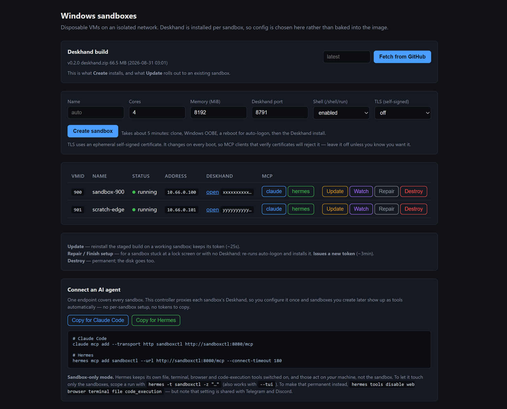
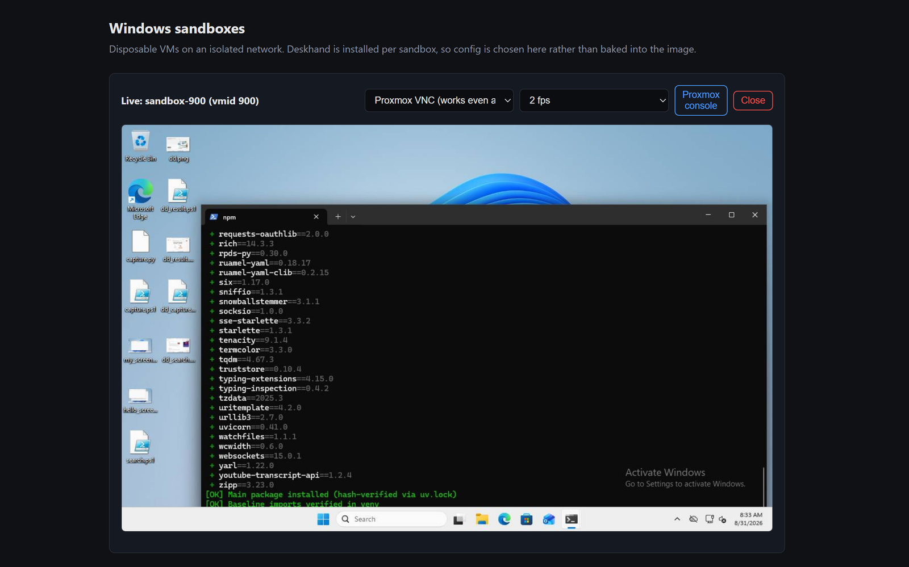
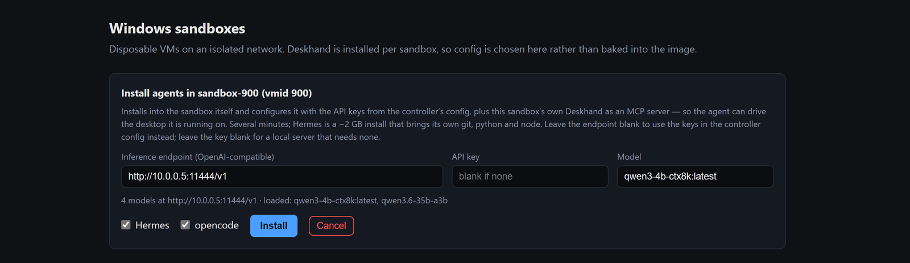

# SandboxMCP

Disposable Windows 11 VMs on Proxmox, driven by an AI agent over MCP.

Ask for a sandbox and about five minutes later you have a clean, network-isolated
Windows 11 machine with [Deskhand](https://github.com/guscatalano/Deskhand)
running in a logged-in desktop session — so an agent can see the screen, move the
mouse, type, and run commands on it. Throw it away when you're done.

The controller is a single Python file with no dependencies outside the standard
library (plus Pillow and `cryptography` for the live screen view). It exposes
**one MCP endpoint** that both manages sandboxes *and* proxies every sandbox's
own Deskhand tools, so an agent configures one server and gets everything.

```
        agent (Claude Code / Hermes)
                    |
                    |  MCP over HTTP  :8080/mcp
                    v
        +-------------------------+
        |  sandboxctl (LXC)       |   web UI + MCP + live screen view
        |                         |
        |  :8080 control  <-- LAN only, never reachable from a sandbox
        |  :8081 payload  <-- the only port sandboxes may reach
        +-------------------------+
             |                 \
             | Proxmox API      \ proxied MCP
             v                   v
        clone / destroy     10.66.0.0/24 (isolated SDN, NATs out)
                            +------------+  +------------+
                            | sandbox 900|  | sandbox 901|  ...
                            |  Deskhand  |  |  Deskhand  |
                            +------------+  +------------+
```



Every sandbox is one row: address, Deskhand token, a copyable MCP command per
client, and the lifecycle buttons. **Watch** opens a live view of any of them.



## What it does

| | |
|---|---|
| **Create** | Linked-clone a sysprepped template, wait out OOBE, apply auto-logon, install Deskhand with a freshly generated token. ~5 min. |
| **Update** | Reinstall the staged Deskhand build in place, keeping the sandbox's token so connected clients keep working. ~25 s. |
| **Repair** | For a sandbox stuck at a lock screen or with no Deskhand: redo auto-logon and install. Issues a new token. |
| **Destroy** | Purges the VM and its disk. |
| **Watch** | Live MJPEG of the screen, from Proxmox's VNC framebuffer *or* Deskhand's own capture. |
| **Agents** | Install Hermes and/or opencode *inside* a sandbox, on demand, preconfigured. |
| **Record** | Continuously records each sandbox's Proxmox console to H.264, in 8-hour chunks. |
| **Proxy** | Every sandbox's Deskhand tools re-exported under one MCP endpoint, namespaced per sandbox. |

The two watch sources are not redundant. **Proxmox VNC works when nothing is
running in the guest** — during Windows setup, at a lock screen, on a boot loop,
on a sandbox whose Deskhand install failed — which is exactly when you need to
see what happened. **Deskhand capture** needs a session but shows what the
automation itself sees.

## Requirements

- Proxmox VE 8.x, one node with room for the VMs
- A Windows 11 ISO and the virtio-win ISO
- An LXC container (Debian/Ubuntu) for the controller: 2+ cores, 1 GiB
- `python3-pil` and `python3-cryptography` in that container

## Setup

### 1. Pool, roles and a scoped API token

The controller must not be able to touch anything but its own sandboxes. That is
enforced in two independent places — Proxmox's own permissions, and a check in
the app — because either one alone is a single point of failure.

```sh
pveum pool add sandboxes
pveum user add sandboxctl@pve
pveum user token add sandboxctl@pve ui --privsep 0

pveum role add SandboxCreate --privs "VM.Allocate,VM.Audit"
pveum role add SandboxClone  --privs "VM.Audit,VM.Clone"
pveum role add SandboxPool   --privs "Pool.Allocate,Pool.Audit"

pveum acl modify /pool/sandboxes    --user sandboxctl@pve --role PVEVMAdmin
pveum acl modify /pool/sandboxes    --user sandboxctl@pve --role SandboxPool
pveum acl modify /sdn/zones/sandbox --user sandboxctl@pve --role PVESDNUser
pveum acl modify /storage/local-lvm --user sandboxctl@pve --role PVEDatastoreUser
pveum acl modify /vms/123           --user sandboxctl@pve --role SandboxClone

# Creating a VM needs VM.Allocate on /vms -- but WITHOUT propagate, or the token
# inherits VM.Allocate on every existing guest on the cluster.
pveum acl modify /vms --user sandboxctl@pve --role SandboxCreate --propagate 0
```

That `--propagate 0` is the whole ballgame. With propagation on, the token can
allocate — and therefore destroy — any VM on the cluster. Verify it after
setup by asking for a guest you do **not** own; it must come back `403`:

```sh
curl -sk -o /dev/null -w '%{http_code}\n' \
  -H "Authorization: PVEAPIToken=sandboxctl@pve!ui=SECRET" \
  https://PVE:8006/api2/json/nodes/NODE/qemu/101/config
```

### 2. An isolated network

Sandboxes get their own subnet so they consume no LAN addresses and cannot see
LAN hosts. A simple SDN zone with SNAT gives them outbound internet and nothing
inbound.

```sh
pvesh create /cluster/sdn/zones --zone sandbox --type simple --ipam pve --nodes NODE
pvesh create /cluster/sdn/vnets --vnet sbx0 --zone sandbox
pvesh create /cluster/sdn/vnets/sbx0/subnets \
    --subnet 10.66.0.0/24 --type subnet \
    --gateway 10.66.0.1 --snat 1 \
    --dhcp-range start-address=10.66.0.100,end-address=10.66.0.200 \
    --dhcp-dns-server 10.66.0.1
pvesh set /cluster/sdn
```

To reach sandboxes *from* your LAN, add a static route for `10.66.0.0/24` via
the Proxmox node on your router.

### 3. The Windows template

See [`windows11/README.md`](windows11/README.md). Short version:

```sh
./build-unattend-iso.sh          # answer file -> ISO
./create-vm.sh                   # unattended install
./switch-to-virtio.sh            # AHCI -> virtio-scsi once Windows is up
./make-template.sh               # sysprep /generalize, convert to template
```

Note the install lands the OS disk on **SATA**, then switches to virtio
afterwards. Installing straight onto virtio-scsi gives `INACCESSIBLE_BOOT_DEVICE`,
because `drvload` in WinPE does not carry the driver into the installed system.

### 4. The controller

```sh
apt install -y python3-pil python3-cryptography
mkdir -p /opt/sandboxctl && cd /opt/sandboxctl
# copy app.py, live.py, sandboxctl.service here
cp config.example.json config.json && chmod 600 config.json && $EDITOR config.json
cp sandboxctl.service /etc/systemd/system/
systemctl enable --now sandboxctl
```

Then open `http://CONTAINER:8080/`, click **Fetch Deskhand** to stage a build,
and **Create sandbox**.

## Recording what Proxmox sees

Set `recordings_dir` (and install `ffmpeg`) and the controller records every
running sandbox's console continuously, rotating an H.264 chunk every 8 hours
and sweeping anything past `recordings_retention_days`.

It records the **VNC framebuffer**, not Deskhand's capture, and that is the
whole point: a sandbox stuck in Windows setup, sitting at a lock screen, or
wedged behind a modal nothing can dismiss is exactly the one worth having
footage of, and in every one of those Deskhand is unreachable.

A desktop is almost entirely static, so 1 fps H.264 costs roughly **50-75 MB per
sandbox per 8-hour chunk** -- the same frames as loose JPEGs would be about
1.4 GB. Give it its own volume; a controller rootfs will not do:

```sh
pct set 115 -mp0 <storage>:300,mp=/recordings,backup=0
pct reboot 115
apt install -y ffmpeg
```

Chunks are fragmented MP4 rather than `+faststart`, so the chunk being written
right now is playable. With 8-hour files the recording you most want to watch is
the one still open, and `+faststart` only writes its index on close -- which
makes exactly that file unopenable.

## Connecting an agent

The controller's own endpoint covers everything — sandboxes you create later
appear as tools automatically, with no per-sandbox setup and no tokens to copy.

```sh
# Claude Code
claude mcp add --transport http sandboxctl http://CONTAINER:8080/mcp

# Hermes
hermes mcp add sandboxctl --url http://CONTAINER:8080/mcp --connect-timeout 180
```

The web UI has copy buttons for both, and per-sandbox commands if you want a
client pointed at a single box directly.

**Scope the agent to the sandboxes.** Both clients keep their own file, terminal
and browser tools enabled, and those act on *your* machine, not the sandbox. In
Hermes, `hermes -t sandboxctl -z "..."` limits a run to the sandbox tools alone
(`hermes tools disable ...` makes it permanent, but that setting is shared with
its Telegram and Discord surfaces).

## Running an agent inside a sandbox

The **Agents** button on a sandbox (or the `install_agents` MCP tool) installs
[Hermes](https://hermes-agent.nousresearch.com) and/or
[opencode](https://opencode.ai) into the guest itself and configures them.

On demand rather than at creation: Hermes alone is a ~2 GB install that brings
its own git, python and node. Both land in the sandbox account's profile and
need no elevation. opencode is a plain zip from its GitHub release, so it needs
no toolchain at all.

Each agent is seeded with:

- an **inference endpoint** -- any OpenAI-compatible server (llama.cpp, vLLM,
  Ollama, LM Studio). Set it per install, or default it with `agents.base_url`.
  Hermes gets `model.provider: custom` plus `model.base_url`; opencode gets a
  `provider` entry using `@ai-sdk/openai-compatible`. The key is optional -- a
  local server that wants none just gets `not-needed`.

  

  The model list is read from the endpoint's `/v1/models` when the panel opens,
  and **models already resident are listed first and preselected**. On a box that
  swaps models in and out of VRAM that is the difference between a reply now and
  a cold load of tens of gigabytes. Servers that do not report residency just
  come back all-equal and sort alphabetically.
- the model name, and the provider keys from `agents.api_keys` if you use a
  hosted provider instead (written to Hermes's `.env`, never to `config.yaml`)
- **that sandbox's own Deskhand as an MCP server.** The address is resolved
  inside the guest, not on the controller: Deskhand binds to the machine's own
  IPv4 and never to loopback, so a `127.0.0.1` URL is refused outright.

Hermes's built-in toolsets are also trimmed on install. It ships 16 of them --
36 KB of tool schema before Deskhand contributes its own 83 tools -- and on a
small local model the schemas alone can exceed the whole context window. `file`,
`terminal` and `code_execution` are kept, because inside a sandbox they act on
the sandbox, which is the point. Set `agents.hermes.disable_toolsets` to `[]` to
keep everything.

**Pick a model with room.** 83 Deskhand tools is roughly 8k tokens of schema on
its own. An 8k-context model cannot hold that plus a system prompt, and the
agent will behave as though the tools are not there.

The picker shows each model's context, and warns below 32k. Note that the
*served* window and the model's *ceiling* are different numbers: a tag pinned to
`num_ctx=8192` still advertises whatever the weights support, so a model listed
as 262,144-capable may be answering with 8,192. Ollama-style servers report the
served window on `/api/ps`; the install passes it to Hermes as
`model.context_length`, which is where it decides to compress history. Left to
auto-detect it reads the ceiling and overflows.

Hermes also gets its web dashboard started as a logon task, with a password
generated per sandbox. The sandbox row then links straight to it. opencode has
no web UI -- `opencode serve` is a headless API -- so it shows as installed and
you drive it on the desktop.

That last one is the interesting part. An agent running inside the sandbox
cannot reach the controller's MCP endpoint -- the firewall rule blocks the
control port from the sandbox subnet, deliberately -- but pointing it at the
Deskhand on its own machine gives it the mouse, keyboard, screen and shell of
the desktop it is sitting on. Deskhand accepts its token as a query parameter,
so this works without either agent needing custom header support, and the
traffic never leaves the guest.

Two things worth knowing before you turn this on:

- **The key is real, and the sandbox is not trusted.** Everything else in a
  sandbox is disposable; a provider credential is not. Use a separate key with
  its own spend limit.
- **Deskhand runs elevated**, via a logon task registered at `RunLevel Highest`.
  It has to: its system-control and UAC tools write `HKLM` policy, and an
  unelevated process cannot obtain admin without a consent prompt on the secure
  desktop that no automation can click. It also means installers Deskhand
  launches inherit elevation and never raise a prompt at all -- which is what
  makes unattended software installs work. The consequence is that the bearer
  token is administrator on that VM.
- **A LAN endpoint needs a hole in the isolation.** Sandboxes are blocked from
  the whole of `192.168.0.0/16` by the `sandbox` security group, so an inference
  server on your LAN is unreachable until you allow it. Keep the exception to one
  host and one port, and put it *above* the DROP rules:

  ```sh
  pvesh create /cluster/firewall/groups/sandbox --type out --action ACCEPT       --dest 10.0.0.5 --dport 11444 --proto tcp --enable 1 --pos 0       --comment 'inference endpoint for in-sandbox agents'
  ```

  The controller's own token cannot do this -- it has no cluster firewall
  rights, deliberately -- so it is a one-time admin change.

## Security model

The threat to design against is a sandbox that gets compromised — that is the
entire point of a sandbox, after all.

- **The control port is unreachable from a sandbox.** A node firewall rule lets
  sandboxes reach `:8081` (payload downloads) and nothing else on the controller.
  Reaching `:8080` would let a compromised guest enumerate every sandbox, read
  each Deskhand token, and create or destroy VMs.
- **Every sandbox gets its own Deskhand token**, generated at creation. One
  compromised sandbox does not yield the others.
- **The app refuses any VM outside its remit.** `_check_managed()` requires the
  VMID to be *both* inside `id_range` *and* a member of the pool. The Proxmox
  token already enforces this; the app checks anyway.
- **Sandboxes cannot see the LAN** — separate subnet, SNAT outbound only.

What this deliberately does not protect: the sandbox itself. Auto-logon stores
its password in the guest registry in clear text, and Deskhand's shell endpoint
runs arbitrary code as the logged-in user. Both are appropriate for a disposable
VM and nowhere else.

## Gotchas worth knowing

Things that cost real time to find:

- **`/agent/file-read` leaks its handle on Windows guests.** `qemu-ga.exe` keeps
  the file open for the rest of its life. Polling a file that way locks it
  permanently — and since `Remove-Item` deletes alphabetically, an update that
  hit such a lock wiped half of `C:\Deskhand` (executable included) before
  failing. Read guest files through `agent/exec` + `Get-Content` instead.
- **Auto-logon cannot be set in the sysprep answer file.** OOBE points
  `AutoAdminLogon` at its temporary `defaultuser0`, then hangs trying to log in
  as that disabled account. Apply it *after* `SystemSetupInProgress` reaches 0,
  and reboot once.
- **Windows 11 auto device encryption breaks sysprep** (`0x80310039`). Set
  `PreventDeviceEncryption` and `manage-bde -off C:` before generalizing.
- **A bad `<Profile>` value rejects the entire answer file**, not just that
  component — `0x80220005`, with no indication of which element was at fault.
- **RFB incremental updates block until the screen changes.** A naive read loop
  looks frozen on an idle desktop; poll with `select` and re-emit the canvas.
- **Proxmox API tokens go in an `Authorization:` header.** A bare
  `PVEAPIToken=...` header reads as an anonymous request and returns 401, which
  looks exactly like a bad secret.

## Layout

```
sandboxctl/
  app.py                 controller: web UI, MCP server, Proxmox driver
  live.py                RFB client + Deskhand capture -> MJPEG
  config.example.json    copy to config.json (gitignored: holds credentials)
  sandboxctl.service     systemd unit
windows11/
  README.md              building the template, in detail
  autounattend.xml       unattended install answer file
  sysprep-unattend.xml   generalize pass
  provision.ps1          first-boot configuration
  install-deskhand.ps1   installs Deskhand + the logon task
  *.sh                   create / clone / template / destroy helpers
  tools/                 VNC screenshot and keystroke senders, for blind installs
```

`windows11/*.sh` run **on the Proxmox node**; `tools/*.py` run anywhere with
network access to it.
