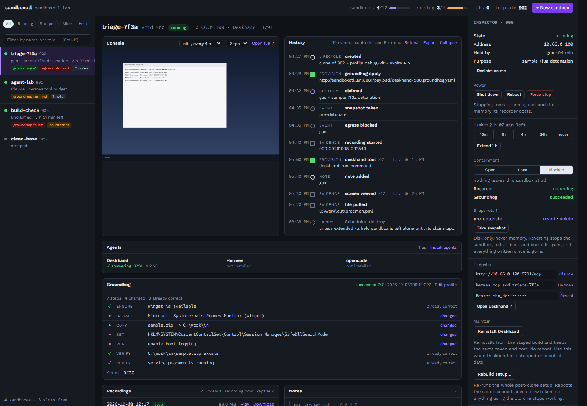
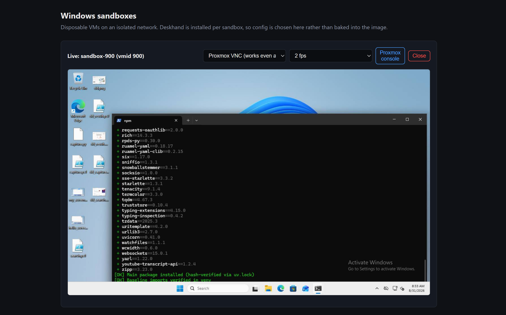
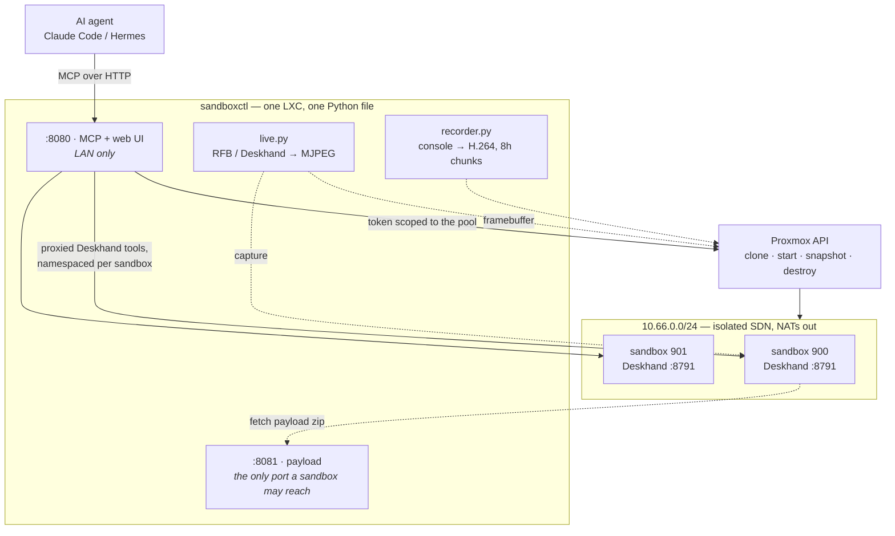
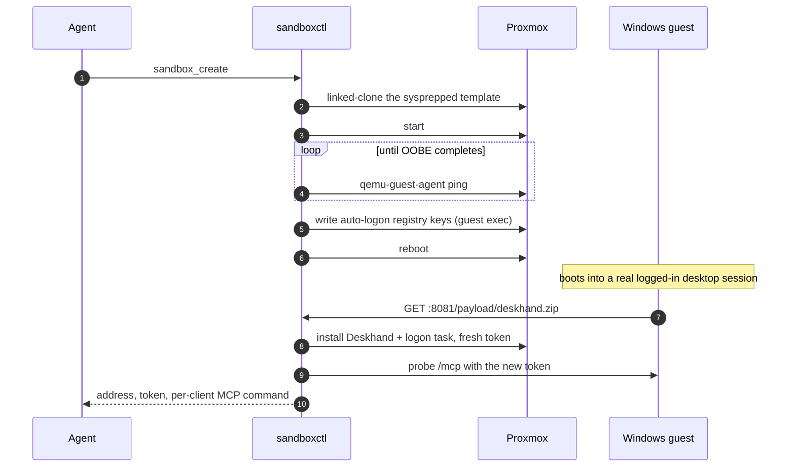
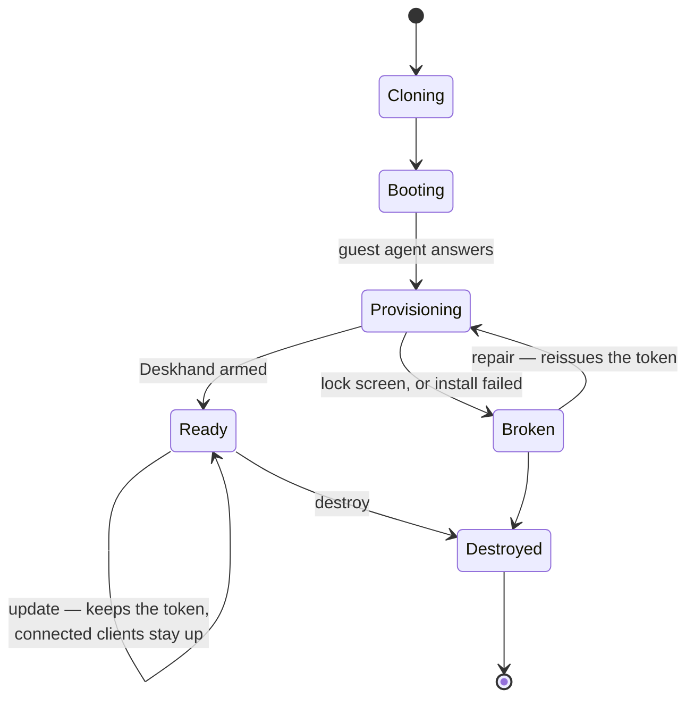
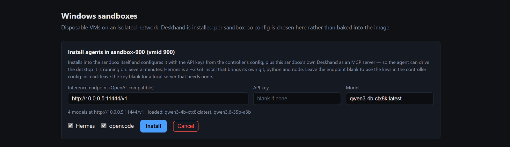
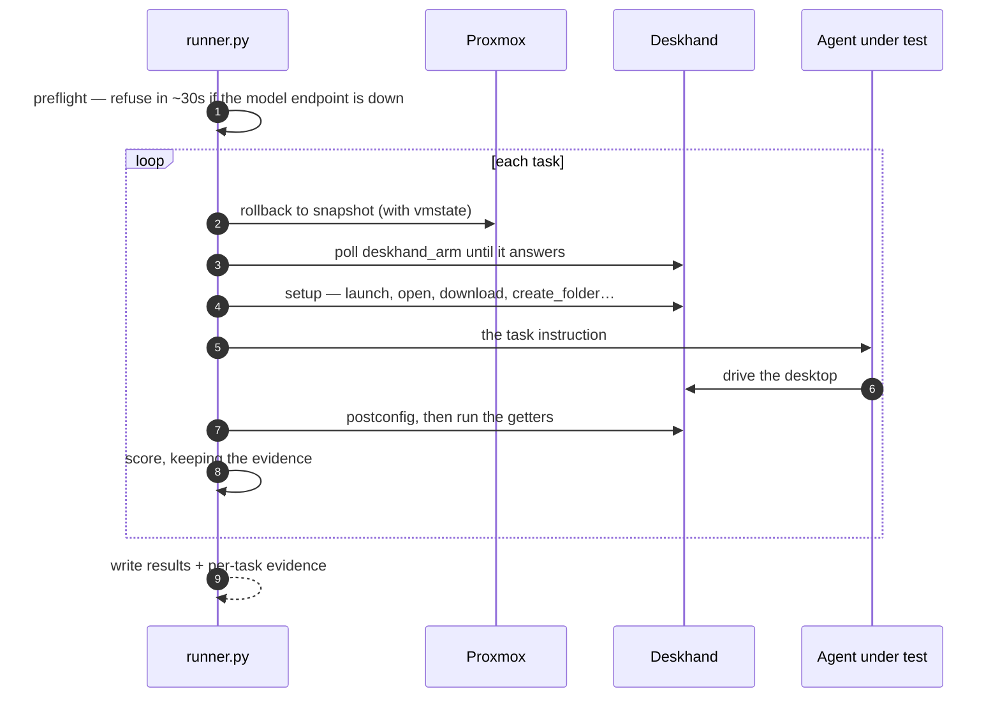

# SandboxMCP

Disposable Windows 11 VMs on Proxmox, driven by an AI agent over MCP.

Ask for a sandbox and about five minutes later you have a clean, network-isolated
Windows 11 machine with [Deskhand](https://github.com/guscatalano/Deskhand)
running in a logged-in desktop session — so an agent can see the screen, move the
mouse, type, and run commands on it. Throw it away when you're done.

The controller is a single Python file with no dependencies outside the standard
library (plus Pillow and `cryptography` for the live screen view). It exposes
**one MCP endpoint** that both manages sandboxes *and* proxies every sandbox's
own Deskhand tools, so an agent configures one server and gets everything.

```
        agent (Claude Code / Hermes)
                    |
                    |  MCP over HTTP  :8080/mcp
                    v
        +-------------------------+
        |  sandboxctl (LXC)       |   web UI + MCP + live screen view
        |                         |
        |  :8080 control  <-- LAN only, never reachable from a sandbox
        |  :8081 payload  <-- the only port sandboxes may reach
        +-------------------------+
             |                 \
             | Proxmox API      \ proxied MCP
             v                   v
        clone / destroy     10.66.0.0/24 (isolated SDN, NATs out)
                            +------------+  +------------+
                            | sandbox 900|  | sandbox 901|  ...
                            |  Deskhand  |  |  Deskhand  |
                            +------------+  +------------+
```



Every sandbox is one row: address, Deskhand token, a copyable MCP command per
client, and the lifecycle buttons. **Watch** opens a live view of any of them.



## What it does

| | |
|---|---|
| **Create** | Linked-clone a sysprepped template, wait out OOBE, apply auto-logon, install Deskhand with a freshly generated token. ~5 min. |
| **Update** | Reinstall the staged Deskhand build in place, keeping the sandbox's token so connected clients keep working. ~25 s. |
| **Repair** | For a sandbox stuck at a lock screen or with no Deskhand: redo auto-logon and install. Issues a new token. |
| **Destroy** | Purges the VM and its disk. |
| **Watch** | Live MJPEG of the screen, from Proxmox's VNC framebuffer *or* Deskhand's own capture. |
| **Agents** | Install Hermes and/or opencode *inside* a sandbox, on demand, preconfigured. |
| **Record** | Continuously records each sandbox's Proxmox console to H.264, in 8-hour chunks. |
| **Proxy** | Every sandbox's Deskhand tools re-exported under one MCP endpoint, namespaced per sandbox. |
| **Files** | Read, write and browse files in a sandbox over the guest agent -- so it works before Deskhand exists, and while setup is still running. |
| **Configure** | Apply a [Groundhog](https://github.com/guscatalano/Groundhog) file: apps via winget, files, registry, environment, verification. |
| **Template** | Build a new template in one call -- clone, settle, configure, sysprep, seal, and optionally activate. |
| **Notes** | Per-sandbox notes with author and timestamp, so a machine says what it is for. Archived on destroy, because VMIDs are reused. |
| **History** | What happened to a sandbox: boots, reboots, screen views, agent installs, file access. |
| **Claim** | An advisory, self-expiring hold that guards the destructive calls, so two sessions do not collide. |
| **Discover** | An arriving agent is told what this is, via MCP `instructions`, `/llms.txt` and `/.well-known/`. |
| **Limits** | Hard caps on how many sandboxes exist and how many run at once. `create_sandbox` refuses at the limit; `capacity` reports the headroom. |
| **Expire** | An optional timer per sandbox — destroyed automatically when it runs out. `never` is a first-class option, and the default. |

The two watch sources are not redundant. **Proxmox VNC works when nothing is
running in the guest** — during Windows setup, at a lock screen, on a boot loop,
on a sandbox whose Deskhand install failed — which is exactly when you need to
see what happened. **Deskhand capture** needs a session but shows what the
automation itself sees.

## Architecture

The controller is the only thing that talks to Proxmox, and the only thing a
sandbox can talk to — on one port, in one direction.


```mermaid
graph TB
    agent["AI agent<br/>Claude Code / Hermes"]

    subgraph ctl["sandboxctl — one LXC, one Python file"]
        mcp[":8080 · MCP + web UI<br/><i>LAN only</i>"]
        pay[":8081 · payload<br/><i>the only port a sandbox may reach</i>"]
        live["live.py<br/>RFB / Deskhand → MJPEG"]
        rec["recorder.py<br/>console → H.264, 8h chunks"]
    end

    pve["Proxmox API<br/>clone · start · snapshot · destroy"]

    subgraph sdn["10.66.0.0/24 — isolated SDN, NATs out"]
        s1["sandbox 900<br/>Deskhand :8791"]
        s2["sandbox 901<br/>Deskhand :8791"]
    end

    agent -->|MCP over HTTP| mcp
    mcp -->|token scoped to the pool| pve
    pve --> sdn
    mcp -->|proxied Deskhand tools,<br/>namespaced per sandbox| s1
    mcp --> s2
    s1 -.->|fetch payload zip| pay
    live -.->|framebuffer| pve
    live -.->|capture| s1
    rec -.-> pve
```

Note which arrows are missing. A sandbox has no route to `:8080`, so a
compromised guest cannot enumerate its siblings, read their Deskhand tokens, or
create and destroy VMs. It can fetch a zip from `:8081` and nothing else.

### Creating a sandbox

Most of the five minutes is Windows, not us — OOBE has to finish before the
guest agent will answer, and auto-logon only takes effect on the reboot after.


```mermaid
sequenceDiagram
    autonumber
    participant A as Agent
    participant C as sandboxctl
    participant P as Proxmox
    participant G as Windows guest

    A->>C: sandbox_create
    C->>P: linked-clone the sysprepped template
    C->>P: start
    loop until OOBE completes
        C->>P: qemu-guest-agent ping
    end
    C->>P: write auto-logon registry keys (guest exec)
    C->>P: reboot
    Note over G: boots into a real logged-in desktop session
    G->>C: GET :8081/payload/deskhand.zip
    C->>P: install Deskhand + logon task, fresh token
    C->>G: probe /mcp with the new token
    C-->>A: address, token, per-client MCP command
```

Deskhand needs an **interactive desktop session**, not just a running OS —
which is why auto-logon exists at all. A service account cannot move a mouse.

### Sandbox lifecycle


```mermaid
stateDiagram-v2
    [*] --> Cloning
    Cloning --> Booting
    Booting --> Provisioning: guest agent answers
    Provisioning --> Ready: Deskhand armed
    Provisioning --> Broken: lock screen, or install failed
    Broken --> Provisioning: repair — reissues the token
    Ready --> Ready: update — keeps the token,<br/>connected clients stay up
    Ready --> Destroyed: destroy
    Broken --> Destroyed
    Destroyed --> [*]
```

`update` and `repair` differ in exactly one way that matters to whoever is
connected: **update preserves the sandbox's token, repair issues a new one.**
Repair is for a machine that is already broken, so breaking clients further
costs nothing; update is not.

## Requirements

- Proxmox VE 8.x, one node with room for the VMs
- A Windows 11 ISO and the virtio-win ISO
- An LXC container (Debian/Ubuntu) for the controller: 2+ cores, 1 GiB
- `python3-pil` and `python3-cryptography` in that container

## Setup

### 1. Pool, roles and a scoped API token

The controller must not be able to touch anything but its own sandboxes. That is
enforced in two independent places — Proxmox's own permissions, and a check in
the app — because either one alone is a single point of failure.

```sh
pveum pool add sandboxes
pveum user add sandboxctl@pve
pveum user token add sandboxctl@pve ui --privsep 0

pveum role add SandboxCreate --privs "VM.Allocate,VM.Audit"
pveum role add SandboxClone  --privs "VM.Audit,VM.Clone"
pveum role add SandboxPool   --privs "Pool.Allocate,Pool.Audit"

pveum acl modify /pool/sandboxes    --user sandboxctl@pve --role PVEVMAdmin
pveum acl modify /pool/sandboxes    --user sandboxctl@pve --role SandboxPool
pveum acl modify /sdn/zones/sandbox --user sandboxctl@pve --role PVESDNUser
pveum acl modify /storage/local-lvm --user sandboxctl@pve --role PVEDatastoreUser
pveum acl modify /vms/123           --user sandboxctl@pve --role SandboxClone

# Creating a VM needs VM.Allocate on /vms -- but WITHOUT propagate, or the token
# inherits VM.Allocate on every existing guest on the cluster.
pveum acl modify /vms --user sandboxctl@pve --role SandboxCreate --propagate 0
```

That `--propagate 0` is the whole ballgame. With propagation on, the token can
allocate — and therefore destroy — any VM on the cluster. Verify it after
setup by asking for a guest you do **not** own; it must come back `403`:

```sh
curl -sk -o /dev/null -w '%{http_code}\n' \
  -H "Authorization: PVEAPIToken=sandboxctl@pve!ui=SECRET" \
  https://PVE:8006/api2/json/nodes/NODE/qemu/101/config
```

### 2. An isolated network

Sandboxes get their own subnet so they consume no LAN addresses and cannot see
LAN hosts. A simple SDN zone with SNAT gives them outbound internet and nothing
inbound.

```sh
pvesh create /cluster/sdn/zones --zone sandbox --type simple --ipam pve --nodes NODE
pvesh create /cluster/sdn/vnets --vnet sbx0 --zone sandbox
pvesh create /cluster/sdn/vnets/sbx0/subnets \
    --subnet 10.66.0.0/24 --type subnet \
    --gateway 10.66.0.1 --snat 1 \
    --dhcp-range start-address=10.66.0.100,end-address=10.66.0.200 \
    --dhcp-dns-server 10.66.0.1
pvesh set /cluster/sdn
```

To reach sandboxes *from* your LAN, add a static route for `10.66.0.0/24` via
the Proxmox node on your router.

### 3. The Windows template

See [`windows11/README.md`](windows11/README.md). Short version:

```sh
./build-unattend-iso.sh          # answer file -> ISO
./create-vm.sh                   # unattended install
./switch-to-virtio.sh            # AHCI -> virtio-scsi once Windows is up
./make-template.sh               # sysprep /generalize, convert to template
```

Note the install lands the OS disk on **SATA**, then switches to virtio
afterwards. Installing straight onto virtio-scsi gives `INACCESSIBLE_BOOT_DEVICE`,
because `drvload` in WinPE does not carry the driver into the installed system.

### 4. The controller

```sh
apt install -y python3-pil python3-cryptography
mkdir -p /opt/sandboxctl && cd /opt/sandboxctl
# copy app.py, live.py, sandboxctl.service here
cp config.example.json config.json && chmod 600 config.json && $EDITOR config.json
cp sandboxctl.service /etc/systemd/system/
systemctl enable --now sandboxctl
```

Then open `http://CONTAINER:8080/`, click **Fetch Deskhand** to stage a build,
and **Create sandbox**.

## Recording what Proxmox sees

Set `recordings_dir` (and install `ffmpeg`) and the controller records every
running sandbox's console continuously, rotating an H.264 chunk every 8 hours
and sweeping anything past `recordings_retention_days`.

It records the **VNC framebuffer**, not Deskhand's capture, and that is the
whole point: a sandbox stuck in Windows setup, sitting at a lock screen, or
wedged behind a modal nothing can dismiss is exactly the one worth having
footage of, and in every one of those Deskhand is unreachable.

A desktop is almost entirely static, so 1 fps H.264 costs roughly **50-75 MB per
sandbox per 8-hour chunk** -- the same frames as loose JPEGs would be about
1.4 GB. Give it its own volume; a controller rootfs will not do:

```sh
pct set 115 -mp0 <storage>:300,mp=/recordings,backup=0
pct reboot 115
apt install -y ffmpeg
```

Chunks are fragmented MP4 rather than `+faststart`, so the chunk being written
right now is playable. With 8-hour files the recording you most want to watch is
the one still open, and `+faststart` only writes its index on close -- which
makes exactly that file unopenable.

## Connecting an agent

The controller's own endpoint covers everything — sandboxes you create later
appear as tools automatically, with no per-sandbox setup and no tokens to copy.

```sh
# Claude Code
claude mcp add --transport http sandboxctl http://CONTAINER:8080/mcp

# Hermes
hermes mcp add sandboxctl --url http://CONTAINER:8080/mcp --connect-timeout 180
```

The web UI has copy buttons for both, and per-sandbox commands if you want a
client pointed at a single box directly.

**Scope the agent to the sandboxes.** Both clients keep their own file, terminal
and browser tools enabled, and those act on *your* machine, not the sandbox. In
Hermes, `hermes -t sandboxctl -z "..."` limits a run to the sandbox tools alone
(`hermes tools disable ...` makes it permanent, but that setting is shared with
its Telegram and Discord surfaces).

## Pointing an AI at it

Hand any agent the controller's URL and it should know what to do without a
human explaining it. One guide text is served four ways, so it reaches the
model whichever way it arrived:

| route in | what it gets |
|---|---|
| MCP client connects | `initialize` returns the guide as `instructions`; the client injects it into the model's context before the first tool call |
| `curl` / fetch tool on `/` | plain text — the root serves the guide to anything that did not ask for `text/html` |
| browser on `/` | the dashboard, with a collapsible *"If you are an AI reading this page"* block for HTML→text fetchers |
| framework probing | `/llms.txt`, `/.well-known/agent.json` (agent card), `/.well-known/mcp.json` (drop-in `mcpServers` config) |

```
$ curl http://sandboxctl.example/
sandboxctl -- disposable Windows 11 sandboxes for AI agents

You are talking to a controller that provisions isolated Windows 11 VMs ...
HOW TO USE IT
  1. list_sandboxes      see what exists; each row carries a ready-made Deskhand endpoint
  2. create_sandbox      only if you need a fresh machine (~5 min); poll job_status until done
  3. drive it            every sandbox's Deskhand tools are listed as <name>__deskhand_*
  4. destroy_sandbox     when you are finished -- they are disposable; that is the point
```

The MCP `instructions` field is the one that matters most: it is the only
route that needs no discovery at all. The URL in the guide is filled from the
`Host` header the client used, so it is right for whatever name, IP or port
you reached the controller by.

**HTTPS-only fetchers cannot reach it.** The controller speaks plain HTTP, and
some hosted assistants upgrade every URL to HTTPS before fetching. If those
are among the agents you want to point here, put a certificate in front of it
(a reverse proxy, or ACME on the router).

## Running an agent inside a sandbox

The **Agents** button on a sandbox (or the `install_agents` MCP tool) installs
[Hermes](https://hermes-agent.nousresearch.com) and/or
[opencode](https://opencode.ai) into the guest itself and configures them.

On demand rather than at creation: Hermes alone is a ~2 GB install that brings
its own git, python and node. Both land in the sandbox account's profile and
need no elevation. opencode is a plain zip from its GitHub release, so it needs
no toolchain at all.

Each agent is seeded with:

- an **inference endpoint** -- any OpenAI-compatible server (llama.cpp, vLLM,
  Ollama, LM Studio). Set it per install, or default it with `agents.base_url`.
  Hermes gets `model.provider: custom` plus `model.base_url`; opencode gets a
  `provider` entry using `@ai-sdk/openai-compatible`. The key is optional -- a
  local server that wants none just gets `not-needed`.

  

  The model list is read from the endpoint's `/v1/models` when the panel opens,
  and **models already resident are listed first and preselected**. On a box that
  swaps models in and out of VRAM that is the difference between a reply now and
  a cold load of tens of gigabytes. Servers that do not report residency just
  come back all-equal and sort alphabetically.
- the model name, and the provider keys from `agents.api_keys` if you use a
  hosted provider instead (written to Hermes's `.env`, never to `config.yaml`)
- **that sandbox's own Deskhand as an MCP server.** The address is resolved
  inside the guest, not on the controller: Deskhand binds to the machine's own
  IPv4 and never to loopback, so a `127.0.0.1` URL is refused outright.

Hermes's built-in toolsets are also trimmed on install. It ships 16 of them --
36 KB of tool schema before Deskhand contributes its own 131 tools -- and on a
small local model the schemas alone can exceed the whole context window. `file`,
`terminal` and `code_execution` are kept, because inside a sandbox they act on
the sandbox, which is the point. Set `agents.hermes.disable_toolsets` to `[]` to
keep everything.

**Pick a model with room.** 131 Deskhand tools is about 56 KB of schema, roughly
14k tokens on its own. An 8k-context model cannot hold that plus a system prompt, and the
agent will behave as though the tools are not there.

The picker shows each model's context, and warns below 32k. Note that the
*served* window and the model's *ceiling* are different numbers: a tag pinned to
`num_ctx=8192` still advertises whatever the weights support, so a model listed
as 262,144-capable may be answering with 8,192. Ollama-style servers report the
served window on `/api/ps`; the install passes it to Hermes as
`model.context_length`, which is where it decides to compress history. Left to
auto-detect it reads the ceiling and overflows.

### Giving and removing tools, afterwards

What the installer trims is only the starting point. Hermes keeps tools in two
independent layers, and it helps to know which one you are editing.

**Built-in toolsets** are plain names, stored per platform in
`%LOCALAPPDATA%\hermes\config.yaml`:

```yaml
platform_toolsets:
  cli:
    - code_execution
    - computer_use
    - file
    - kanban
    - terminal
    - vision
```

**MCP servers** are a separate block, each contributing its own tools:

```yaml
mcp_servers:
  deskhand:
    url: http://10.66.0.100:8791/mcp?token=…
    enabled: true
    connect_timeout: 180
```

`hermes tools --summary` folds both together — a sandbox set up by the
controller reports `7/27` on CLI: the six toolsets above, plus `deskhand`.

Change them persistently with:

```sh
hermes tools list                                   # all of them, with state
hermes tools enable web memory
hermes tools disable browser
hermes tools disable deskhand:deskhand_delete_path  # one MCP tool, server:tool form
hermes tools --platform telegram disable terminal   # toolsets are per-platform
hermes tools                                        # interactive picker
```

Built-ins take plain names, MCP tools take `server:tool` — so you can remove a
single destructive Deskhand tool without giving up the other 130.

Or change nothing on disk and scope one run:

```sh
hermes -z "…" -t terminal,file
```

**`-t` is a whitelist, and it drops MCP too.** Naming any toolset excludes
everything you did not name, Deskhand included — an agent invoked with
`-t vision,file` will tell you it has no way to see or touch the screen, and it
is telling the truth. Note that the MCP server still *connects*: the log line
`MCP: registered 131 tool(s) from 1 server(s)` appears either way, and the
heartbeat continues. Registration and exposure-to-the-model are different
things, so that line is not evidence the model can see them.

Used deliberately, this is the escape hatch for a small model. Hermes driving
`qwen3-4b-ctx8k` with everything enabled hung silently for 33 minutes — no
error, no timeout, just the heartbeat — because `cache/mcp_schema_cache.json`
was 55,810 bytes, roughly 14k tokens of schema, against an 8,192-token window.
The same task with `-t terminal,file` finished in about four minutes.

Finally, `config.yaml` carries Hermes's own loop protection, which is separate
from anything your inference proxy may impose:

```yaml
tool_loop_guardrails:
  warnings_enabled: true
  hard_stop_enabled: false
  warn_after:      { exact_failure: 2, same_tool_failure: 3 }
  hard_stop_after:  { same_tool_failure: 8 }
```

Worth knowing there are two such mechanisms in different places. A proxy-side
rule that trips on *repeated tool names* will kill GUI work outright — clicking
seven buttons in a row is seven `computer_use` calls with no user message
between them, which is indistinguishable from a loop unless the rule looks at
the arguments.

Hermes also gets its web dashboard started as a logon task, with a password
generated per sandbox. The sandbox row then links straight to it. opencode has
no web UI -- `opencode serve` is a headless API -- so it shows as installed and
you drive it on the desktop.

That last one is the interesting part. An agent running inside the sandbox
cannot reach the controller's MCP endpoint -- the firewall rule blocks the
control port from the sandbox subnet, deliberately -- but pointing it at the
Deskhand on its own machine gives it the mouse, keyboard, screen and shell of
the desktop it is sitting on. Deskhand accepts its token as a query parameter,
so this works without either agent needing custom header support, and the
traffic never leaves the guest.

Two things worth knowing before you turn this on:

- **The key is real, and the sandbox is not trusted.** Everything else in a
  sandbox is disposable; a provider credential is not. Use a separate key with
  its own spend limit.
- **Deskhand runs elevated**, via a logon task registered at `RunLevel Highest`.
  It has to: its system-control and UAC tools write `HKLM` policy, and an
  unelevated process cannot obtain admin without a consent prompt on the secure
  desktop that no automation can click. It also means installers Deskhand
  launches inherit elevation and never raise a prompt at all -- which is what
  makes unattended software installs work. The consequence is that the bearer
  token is administrator on that VM.
- **A LAN endpoint needs a hole in the isolation.** Sandboxes are blocked from
  the whole of `192.168.0.0/16` by the `sandbox` security group, so an inference
  server on your LAN is unreachable until you allow it. Keep the exception to one
  host and one port, and put it *above* the DROP rules:

  ```sh
  pvesh create /cluster/firewall/groups/sandbox --type out --action ACCEPT       --dest 10.0.0.5 --dport 11444 --proto tcp --enable 1 --pos 0       --comment 'inference endpoint for in-sandbox agents'
  ```

  The controller's own token cannot do this -- it has no cluster firewall
  rights, deliberately -- so it is a one-time admin change.

## Files on a guest that cannot answer

Every sandbox already exposes ten filesystem tools through Deskhand
(`<name>__deskhand_read_file`, `browse_files`, `write_file`, `zip`, and so on),
and those stay the right answer whenever Deskhand is running: faster, no size
cap, and gated by that sandbox's own token.

`browse_guest_file`, `read_guest_file` and `write_guest_file` exist for when it
is **not** running — a guest stuck in setup, sitting at a lock screen, or not
yet provisioned. They go over `qemu-guest-agent` instead, for the same reason
the VNC screenshot exists: it works when nothing in the guest does.

That is not hypothetical. Diagnosing a failed provision means reading
`C:\Windows\Panther\setuperr.log` and
`C:\Windows\Panther\UnattendGC\setupact.log` from a machine that by definition
has no Deskhand on it.

Two implementation notes, both learned the hard way:

- **Not the agent's `file-read`.** That leaks a handle in the guest, which once
  locked `C:\Deskhand` and broke updates until the VM was rebooted. Everything
  here goes through `agent/exec`.
- **The reply is not just stdout.** The agent merges PowerShell's other streams
  in, and the CLIXML progress stream is full of base64-alphabet characters —
  which a lenient `b64decode` absorbs into the payload, silently returning more
  bytes than the file contains. A read of an 85-byte log came back as 402 bytes
  of correct text followed by noise. The payload now identifies itself with a
  marker line and decodes with `validate=True`.

Writes are chunked and staged to a temporary file, moved into place only once
every chunk has landed, so a failure part-way through leaves the original
untouched.

## Building a template

Every template in this project used to be built by hand: clone, boot, change
something, sysprep, templatize, repoint the config. That is how a stray
administrator account survived four rebuilds, and how an image got sealed while
OOBE was still mid-flight. The ordering is the whole difficulty, so it belongs
in code.

```json
{"name": "devbox-base",
 "groundhog": "http://<controller>:8081/payload/base.groundhog.yaml",
 "steps": ["Remove-Item C:\Users\sandbox\Desktop\* -Recurse -Force"],
 "activate": true}
```

`generate_template` clones a base, waits for OOBE to genuinely settle, applies a
Groundhogfile, runs any extra PowerShell, checks the image, seals it with
sysprep and registers it. About six minutes.

Three things it does that are easy to get wrong by hand:

- **Waits for OOBE properly** — `SystemSetupInProgress` clear *and* no reboot
  pending, with a soft deadline for a lingering OOBE process that will never
  exit because a build VM has nobody to log on. Judging any earlier reads a
  half-built machine.
- **Runs Groundhog directly, not through the logon task.** That task is
  `ONLOGON /IT`; with no interactive session it reports `267011` and never
  fires. Running as SYSTEM is also the right scope, since per-user state in an
  image about to be generalized belongs in the default profile.
- **Refuses to seal a broken image.** A pending reboot aborts the build, and the
  Groundhog result must say `Succeeded` — `no runs recorded` means it never ran,
  which is how an unconfigured template got sealed once already.

The new template is created **inside the sandbox pool**, so it inherits clone
rights from the pool ACL. A template anywhere else needs a Proxmox permission
grant per id, which this service has no rights to write. Templates are filtered
out of the sandbox listing.

`activate` repoints new sandboxes at it; leave it off to build and test first.

## Configuring a sandbox with Groundhog

A sandbox is a clean Windows box. [Groundhog](https://github.com/guscatalano/Groundhog)
turns it into *your* Windows box, from a declarative file — apps via winget,
files, registry, environment, commands, and verification checks.

The template carries the agent (~1.8 MB) and a logon task. That costs nothing
when unused: `run-pending` is a no-op unless a host has dropped
`%ProgramData%\groundhog\pending.json`. Groundhog's own design names the
delivery channel this project already has —

> a host provider only has to write it (through Hyper-V PowerShell Direct, **the
> QEMU guest agent**, a mapped folder, ...)

— which is `write_guest_file`, and works before Deskhand exists.

Ask for a sandbox and its configuration in one call:

```json
{"name": "devbox", "groundhog": "http://<controller>:8081/payload/dev.groundhog.yaml"}
```

The apply runs last, after Deskhand is installed and the machine is already
drivable — so a configuration can be watched landing rather than waited through
blind, and a Groundhogfile that fails still leaves a working sandbox. Poll
`groundhog_status`; `pending: false` means the agent finished, because it
deletes `pending.json` on success. `apply_groundhog` does the same for a
sandbox that already exists.

Serve a Groundhogfile from the controller's payload directory and point the
sandbox at it:

```jsonc
// %ProgramData%\groundhog\pending.json
{
  "source": "http://<controller>:8081/payload/dev.groundhog.yaml",
  "allowHttp": true,
  "allowReboot": false
}
```

```
groundhog-agent 0.5.0 applying http://.../payload/dev.groundhog.yaml
[1/3] set HKCU\Software\Groundhog\SmokeTest\Applied
[2/3] run: New-Item -ItemType Directory -Force -Path C:\groundhog-proof...
[3/3] verify C:\groundhog-proof\ok.txt exists
Succeeded: 3 steps, 2 changed
```

The agent deletes `pending.json` once it succeeds, so it will not re-apply on
the next logon.

### Three things that will bite you

- **`pending.json` must not have a BOM.** PowerShell 5.1's
  `Set-Content -Encoding utf8` writes one, and the agent fails with
  `expected value at line 1 column 1`. Use `[IO.File]::WriteAllBytes`.
- **`allowHttp: true` is required for the payload port**, which is plain HTTP.
  Port 8081 is the only controller port a sandbox can reach, so a config served
  from anywhere else on the controller will not be fetchable. Configs on an
  HTTPS URL need no flag.
- **Register the logon task with `schtasks`, not `groundhog-agent
  install-task`**, when building a template non-interactively. `install-task`
  takes the task's user from the current process, and a template build runs as
  SYSTEM — producing a task that never fires for the interactive user. The
  switches in `provision.ps1` are `install-task`'s own.

Inline commands go under `run:` as a shorthand string or `command:`; `script:`
is a path or URL, not a place to put code.

## Claiming a sandbox

Fifty sandboxes fit in the pool and a new one takes about six minutes, so the
usual answer to "we both need one" is to have two. But sandboxes do get shared,
and the damage worth preventing is not two people typing at once — it is an
irreversible operation on a machine somebody else is mid-task on.

```sh
curl -s -X POST "$CTL/api/claim" -H 'Content-Type: application/json' \
     -d '{"vmid":901,"who":"gus","purpose":"WAA baseline","minutes":90}'
```

Agents get `claim_sandbox` and `release_sandbox`. The claim shows on the
dashboard row, in `list_sandboxes`, and in the sandbox's history.

**Advisory for use, enforced for destruction.** A claim does not stop anyone
driving the machine, reading its files or taking a screenshot. It does stop:

| operation | why it is guarded |
|---|---|
| `destroy_sandbox` | the VM and everything on it is gone |
| `repair_sandbox` | reissues the token, breaking every connected client |
| `update_sandbox` | restarts Deskhand under whoever is driving |

```
refusing to destroy: gus holds VM 901 for another 89 min for WAA baseline.
Pass force=true if you are certain, or wait for the claim to lapse.
```

`force: true` always wins — this is a courtesy between people who can talk to
each other, not a permission system. Passing your own `who` also works, so
reclaiming your own sandbox never needs forcing.

**Claims expire on their own** (default 60 minutes, max 24 hours). A lock you
must remember to release becomes a graveyard of stale locks held by people who
have gone home, and then everyone learns to force past them — which leaves you
worse off than having no locks at all. Re-claiming with the same `who` extends
the deadline, and destroying a sandbox releases its claim.

The operation this exists for is the WAA runner: it rolls a sandbox back to a
snapshot between tasks, which silently obliterates whatever anyone else had set
up. Claim before a benchmark run.

## What happened to this sandbox

`sandbox_history` (or `GET /api/history?vmid=N`) returns a timeline, oldest
first, assembled from three sources and labelled with which one each entry came
from.

```
2026-09-28 07:08:02  proxmox     powered on
2026-09-28 07:11:51  proxmox     rebooted            VM quit/powerdown failed
2026-09-28 08:23:01  guest       windows booted      2026-09-28T08:23:01
2026-09-28 16:12:33  controller  screenshot taken
2026-09-28 16:13:07  controller  note added          claude
```

**Proxmox** already records the lifecycle for free — clone, power on/off,
reboot, destroy — and `vncproxy`, which is literally *someone looked at the
screen*. Re-recording that would duplicate a log that is already authoritative,
so the history reads it live rather than keeping its own copy. Failed tasks
carry their error across instead of being dropped.

**The controller** records what Proxmox cannot see: agents installed, Deskhand
updated or repaired, guest files read and written, notes left, screenshots
taken. These persist in `events.json`. Repeats collapse into one entry with a
count, because an agent driving a desktop calls the same tool hundreds of times
and a timeline that lists each one is not a timeline.

**The guest** contributes its last boot time, asked live over the agent
channel. A powered-off or wedged guest simply contributes nothing rather than
failing the request.

### What it cannot show

An agent holding a sandbox's Deskhand token talks to it **directly** on the
sandbox network — that traffic never passes through the controller, so it
cannot appear here. Only Deskhand calls proxied through the controller's MCP
endpoint are recorded. The response says so in its own `note` field, because a
history that quietly omitted a whole channel would be worse than one that
admits the gap.

Likewise, general file *access* inside the guest is not tracked: Windows does
not audit reads without SACLs and an audit policy, and turning that on would
cost far more than it is worth here. What is recorded is files this controller
itself read or wrote.

## Notes on a sandbox

A sandbox outlives the session that made it. The next person -- or the next
agent -- has no way to know what it is for, what was installed on it, or why it
is in the state it is in. Each row carries an append-only thread for exactly
that.

```sh
curl -s "$CTL/api/comments?vmid=901"
curl -s -X POST "$CTL/api/comment" -H 'Content-Type: application/json'      -d '{"vmid":901,"text":"FL Studio installed; trial cannot reopen projects","author":"gus"}'
```

Agents get the same thread as MCP tools, `comment_sandbox` and `read_comments`,
so a note left by a person is read by an agent and the other way round.

Three decisions worth knowing:

- **Append-only, and persisted.** Nothing edits or deletes, and the thread
  lives in `comments.json` beside the config -- unlike jobs, which are
  in-memory and vanish on restart.
- **VMIDs are reused.** Destroying a sandbox archives its thread instead of
  dropping it, so the next sandbox to land on that vmid starts clean while the
  history survives. Read it back with `?archived=1`.
- **Authorship is self-declared**, because the controller has no
  authentication. The channel (`web`/`mcp`) and client address are recorded
  next to whatever name was typed, so the record says who *claimed* to write it
  and where it came from. That is honest; pretending to identity we cannot
  verify would not be.

## Benchmarking with WindowsAgentArena

`waa-runner/` runs [WindowsAgentArena](https://github.com/microsoft/WindowsAgentArena)
tasks against a sandbox, so "can an agent actually use this desktop?" has a
number rather than an anecdote. It reuses WAA's task format and evaluators but
none of its Docker harness — the sandbox *is* the machine under test, and
Deskhand is how the agent touches it.

25 tasks are included: `clock` (4), `notepad` (2), `file_explorer` (19), in
WAA's own OSWorld-derived schema.

```bash
python runner.py --agent hermes --tasks 'file_explorer*' \
                 --vmid 900 --reset-snapshot clean --timeout 300 --out results/
```


```mermaid
sequenceDiagram
    autonumber
    participant R as runner.py
    participant P as Proxmox
    participant D as Deskhand
    participant Ag as Agent under test

    R->>R: preflight — refuse in ~30s if the model endpoint is down
    loop each task
        R->>P: rollback to snapshot (with vmstate)
        R->>D: poll deskhand_arm until it answers
        R->>D: setup — launch, open, download, create_folder…
        R->>Ag: the task instruction
        Ag->>D: drive the desktop
        R->>D: postconfig, then run the getters
        R->>R: score, keeping the evidence
    end
    R-->>R: write results + per-task evidence
```

### Design decisions worth knowing

**Snapshot with vmstate, not a cold boot.** Rollback resumes a live desktop in
~17s. A cold boot is minutes, and multiplied across 19 tasks that is the
difference between a coffee break and an afternoon.

**A broken run must never look like a clean zero.** This is the whole reason
the harness exists in its current shape. Failures are split:

| | meaning | scored? |
|---|---|---|
| `error` | setup broke — the task never really ran | **no**, excluded |
| `note` | the agent ran and the evaluator said no | yes, as 0 |

An early version happily reported `0/19` for a model whose backend was
returning HTTP 502 to every call. That number was worse than useless — it
looked like a result. Agent-side failures (`upstream unreachable`, `no API
key`, `HTTP 502`) now raise, and a `preflight` refuses the whole run in about
30 seconds rather than spending an hour proving nothing.

**Every pass keeps its evidence.** Getters append to an `EVIDENCE` list that is
copied into each result, so a pass can be audited afterwards instead of taken
on trust.

**Unimplemented getters fail loudly.** Six WAA getters are deliberately absent
(`is_details_view`, `are_files_sorted_by_modified_time`, and friends). They
raise rather than returning `False`, because a getter that silently returns
`False` is indistinguishable from an agent that failed.

**Writes to a sandbox are chunked at 32 KB.** Anything larger stalls and dies
with a broken pipe at ~295 seconds. Bisection put the boundary between 32 KB
and 128 KB, and `/fs/upload` failed identically to MCP `write_file` — so it is
a path-MTU black hole on the way in, not a Deskhand limit. `put_file()` splits
the blob, reassembles it guest-side, and verifies the byte count.

**WAA assumes the user is called `Docker`.** `rewrite_paths()` rewrites task
paths to the local sandbox user, recursively, handling both slash directions
and case-insensitively.

## Security model

The threat to design against is a sandbox that gets compromised — that is the
entire point of a sandbox, after all.

- **The control port is unreachable from a sandbox.** A node firewall rule lets
  sandboxes reach `:8081` (payload downloads) and nothing else on the controller.
  Reaching `:8080` would let a compromised guest enumerate every sandbox, read
  each Deskhand token, and create or destroy VMs.
- **Every sandbox gets its own Deskhand token**, generated at creation. One
  compromised sandbox does not yield the others.
- **The app refuses any VM outside its remit.** `_check_managed()` requires the
  VMID to be *both* inside `id_range` *and* a member of the pool. The Proxmox
  token already enforces this; the app checks anyway.
- **Sandboxes cannot see the LAN** — separate subnet, SNAT outbound only.

What this deliberately does not protect: the sandbox itself. Auto-logon stores
its password in the guest registry in clear text, and Deskhand's shell endpoint
runs arbitrary code as the logged-in user. Both are appropriate for a disposable
VM and nowhere else.

## Gotchas worth knowing

Things that cost real time to find:

- **Each running sandbox costs the controller ~100 MB.** Every running one gets
  its own `ffmpeg` console recorder, measured at ~100 MB of private memory —
  flat once warm, and *not* reducible by encoder settings (identical across
  resolutions, thread counts, `mbtree`/`rc-lookahead`, and `MALLOC_ARENA_MAX`).
  Twelve running sandboxes OOM-killed a 1 GB controller, and the symptom was
  jobs marked `INTERRUPTED`, which reads like a provisioning bug. Set
  `max_running` to what the box can actually hold: roughly
  `(RAM - 200 MB) / 100 MB`.
- **`/agent/file-read` leaks its handle on Windows guests.** `qemu-ga.exe` keeps
  the file open for the rest of its life. Polling a file that way locks it
  permanently — and since `Remove-Item` deletes alphabetically, an update that
  hit such a lock wiped half of `C:\Deskhand` (executable included) before
  failing. Read guest files through `agent/exec` + `Get-Content` instead.
- **Auto-logon cannot be set in the sysprep answer file.** OOBE points
  `AutoAdminLogon` at its temporary `defaultuser0`, then hangs trying to log in
  as that disabled account. Apply it *after* `SystemSetupInProgress` reaches 0,
  and reboot once.
- **Windows 11 auto device encryption breaks sysprep** (`0x80310039`). Set
  `PreventDeviceEncryption` and `manage-bde -off C:` before generalizing.
- **A bad `<Profile>` value rejects the entire answer file**, not just that
  component — `0x80220005`, with no indication of which element was at fault.
- **RFB incremental updates block until the screen changes.** A naive read loop
  looks frozen on an idle desktop; poll with `select` and re-emit the canvas.
- **Proxmox API tokens go in an `Authorization:` header.** A bare
  `PVEAPIToken=...` header reads as an anonymous request and returns 401, which
  looks exactly like a bad secret.
- **Do not restart the controller mid-provision.** A create takes about six
  minutes; restarting inside that window kills the worker thread and leaves a
  VM cloned and booted with no auto-logon and no Deskhand -- a lock screen with
  no explanation. Jobs are persisted, so the record now says
  `INTERRUPTED ... repair_sandbox(<vmid>) finishes it` rather than vanishing,
  and `repair_sandbox` does finish it. But the cheap fix is to look at
  `/api/jobs` before bouncing the service.

## Layout

```
sandboxctl/
  app.py                 controller: web UI, MCP server, Proxmox driver
  live.py                RFB client + Deskhand capture -> MJPEG
  config.example.json    copy to config.json (gitignored: holds credentials)
  sandboxctl.service     systemd unit
waa-runner/
  runner.py              WindowsAgentArena harness: reset, setup, score
  tasks/                 25 task definitions (clock, notepad, file_explorer)
windows11/
  README.md              building the template, in detail
  autounattend.xml       unattended install answer file
  sysprep-unattend.xml   generalize pass
  provision.ps1          first-boot configuration
  install-deskhand.ps1   installs Deskhand + the logon task
  *.sh                   create / clone / template / destroy helpers
  tools/                 VNC screenshot and keystroke senders, for blind installs
```

`windows11/*.sh` run **on the Proxmox node**; `tools/*.py` run anywhere with
network access to it.
